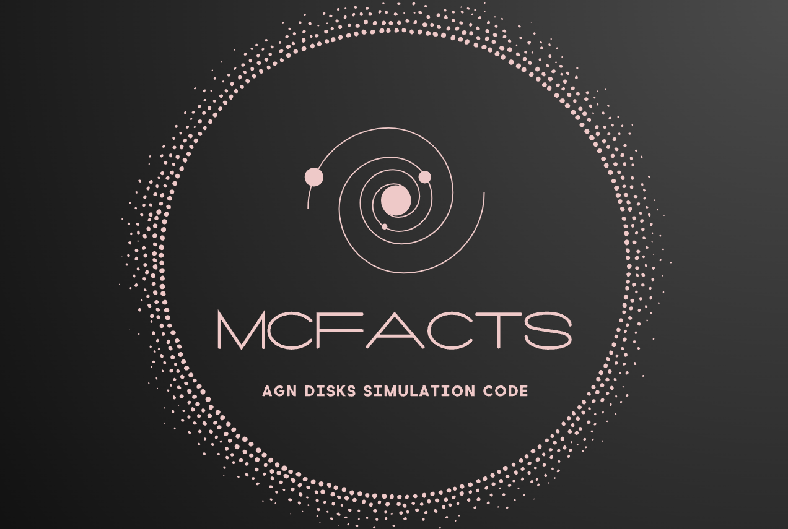

<h1 align="center">
    <br>
    <a href="https://github.com/McFACTS/McFACTS"></a>
    <br>
    <span style="font-weight: normal">
        <b>M</b>onte <b>c</b>arlo <b>F</b>or <b>A</b>GN <b>C</b>hannel <b>T</b>esting and <b>S</b>imulations
    </span>  
    <br>
</h1>

<h4 align="center">A python package that does the AGN channel for you!</h4>

McFACTS is the first public, open source, population synthesis code modeling the *full* AGN channel for LVK detectable BBH mergers.

### Documentation

You can find more information about McFACTS as well as contact and office hour information at our [website](https://saavikford.wixsite.com/saavik/general-7). It's a work in progress, so please be patient!

You can find documentation for our code and modules at our [Read the Docs](https://mcfacts.readthedocs.io).

Input and outputs are documented in [`IOdocumentation.txt`](https://github.com/McFACTS/McFACTS/blob/main/IOdocumentation.txt). 

Want build or browse the docs locally? Run the following:

```bash
# Switch to the mcfacts-dev environment and install required packages to build the docs
$ conda activate mcfacts-dev
$ conda install sphinx sphinx_rtd_theme sphinx-autoapi sphinx-automodapi

# Switch to the docs directory
$ cd docs

# Clean up any previous generated docs 
$ make clean

# Generate the html version of the docs in ./docs/build/html
$ make html
```

### Installation

To clone and run this application, you'll need [Git](https://git-scm.com) and [Conda](https://docs.conda.io/en/latest/).

The latest development version is available directly from our [GitHub Repo](https://github.com/McFACTS/McFACTS). To start, clone the repository:

```bash
$ git clone https://github.com/McFACTS/McFACTS
$ cd McFACTS
```

#### Automated Setup

Contained in the `Makefile` are a few make commands to get everything setup and running.

> **Note:**
> If you are running on Windows or want to set things up manually, skip to the [manual](#manual-setup) section below.

```bash
# Create the conda environment and install required packages
$ make setup

# Activate the conda environment that was created for us
$ conda activate mcfacts-dev

# Run mcfacts_sim.py with default initial values, then run population_plots.py
$ make plots
```

Done! Below are some extra commands that you might find helpful

```bash
# Delete your runs directory and other output files
$ make clean

# Re install the mcfacts package for changes to take effect
$ make install
```

#### Manual Setup

We recommend that you create a Conda environment for working with McFACTS.
You can do this by running

```bash
# Create the conda environment with some default packages installed
$ conda create --name mcfacts-dev "python>=3.10.4" pip -c conda-forge -c defaults

# Activate the enviornment we just created
$ conda activate mcfacts-dev

# Install the mcfacts package
$ python -m pip install --editable .

# Now all that we have left to do is run McFACTS!
$ python mcfacts_sim.py --galaxy_num 10 --fname-ini ./recipes/model_choice_old.ini --fname-log out.log --seed 3456789012
```

Our default inputs are located at `./recipes/model_choice_old.ini`. Edit this file or create your own `model_choice.ini` file with different inputs.

To use a different ini file, replace the file path after the `--fname-ini` argument.

```bash
$ python mcfacts_sim.py --fname-ini /path/to/your/file.ini
```

### Output Files

Output files will appear in `runs`. For each timestep there will be a folder called `gal$N`, with `$N` as the run number. Inside that folder will be `initial_params_bh.dat` which records the initial parameters of all black holes in the simulation and `output_mergers.dat` which records the details of every merger throughout that run. If you are trying to get distributions of merger properties, you probably only need `output_mergers.dat`. If you are trying to track the history of individual mergers or want to know e.g. the state of the nuclear star cluster after an AGN of some duration, you might want to enable the command line option `--save_snapshots`, which will then write `output_bh_single_$ts.dat` and `output_bh_binary_$ts.dat` where `$ts` is the timestep number (0-N)---these files track every single/binary in the simulation at that timestep.

Once all the runs are finished, McFACTS will write the following data files:

* `out.log` records all input parameters for the runs
* `output_mergers_population.dat` details of all BBH mergers
* `output_mergers_survivors.dat` details of all BHs (single and binary) at the end of the AGN
* `output_mergers_lvk.dat` BBH with GW frequencies in the LISA/LVK bands
* `output_mergers_emris.dat` properties of EMRIs

McFACTS will also generate the following plots:

* `gw_strain.png` GW frequency characteristic strain per frequency per year vs average GW frequency
* `m1m2.png` $M_1$ vs $M_2$ as a function of BH generation
* `merger_mass_v_radius.png` Mass of BH merger mass as a function of disk radius and generation
* `merger_remnant_mass.png` Number of BH mergers as a function of remnant mass and BH generation
* `q_chi_eff.png` BH mass ratio ($q=M_{2}/M_{1}$) as a function of $\chi_{\rm eff}$ and BH generation
* `r_chi_p.png` $\chi_\mathrm{p}$ as a function of disk radius and generation
* `time_of_merger.png` Mass of BH merger mass against time of merger and BH generation


### Citing McFACTS

Paper 1: (https://arxiv.org/abs/2410.16515)

McFACTS is developed by Barry McKernan, K. E. Saavik Ford, Harrison E. Cook, Vera Delfavero, Kaila Nathaniel, Jake Postiglione, Shawn Ray, and Richard O'Shaughnessy. If you use McFACTS in your work, please cite the following:

* McKernan, B., Ford, K.E.S., Cook, H.E., et al., *McFACTS I: Testing the LVK AGN channel with Monte Carlo for AGN Channel Testing and Simulation (McFACTS)*. 2024. ([arXiv](https://arxiv.org/abs/2410.16515))